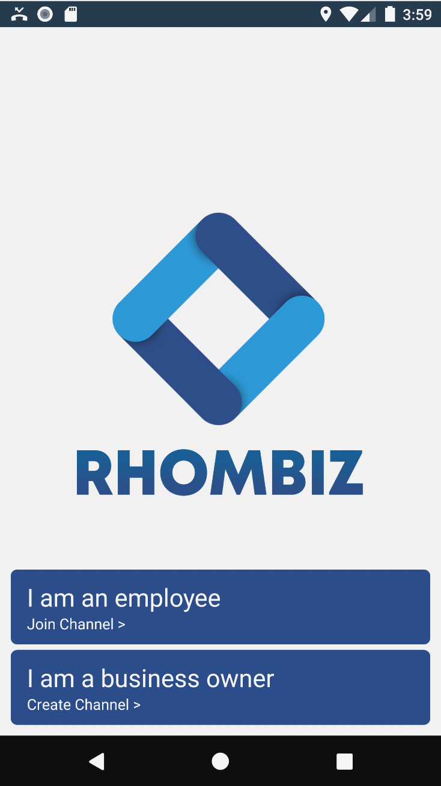
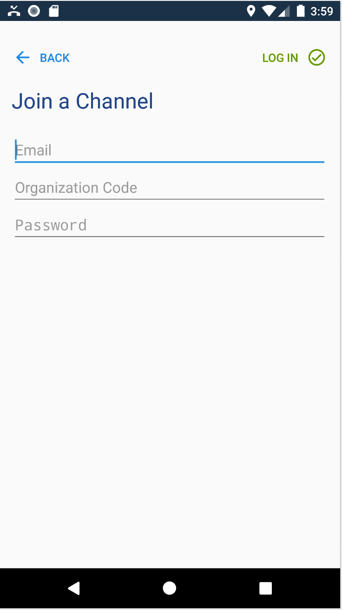
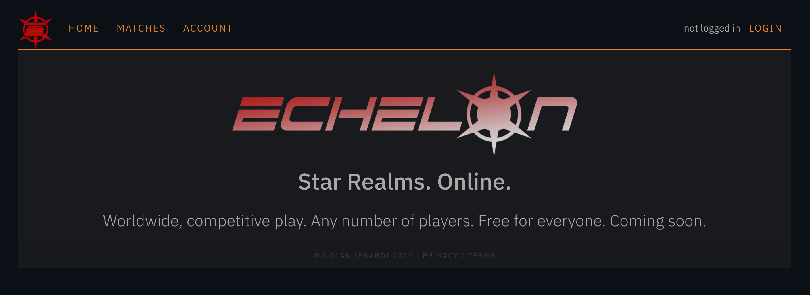
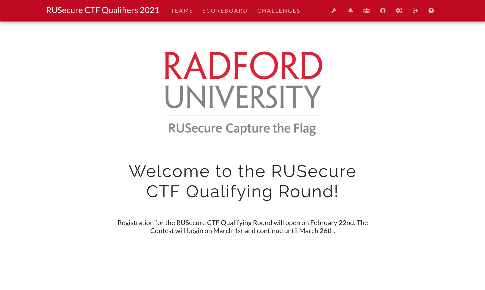
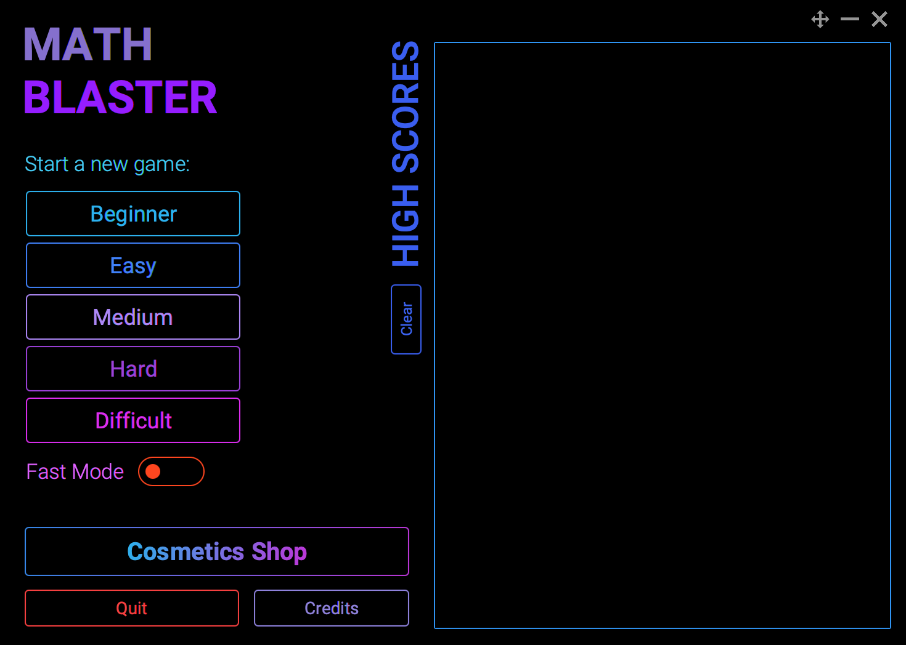
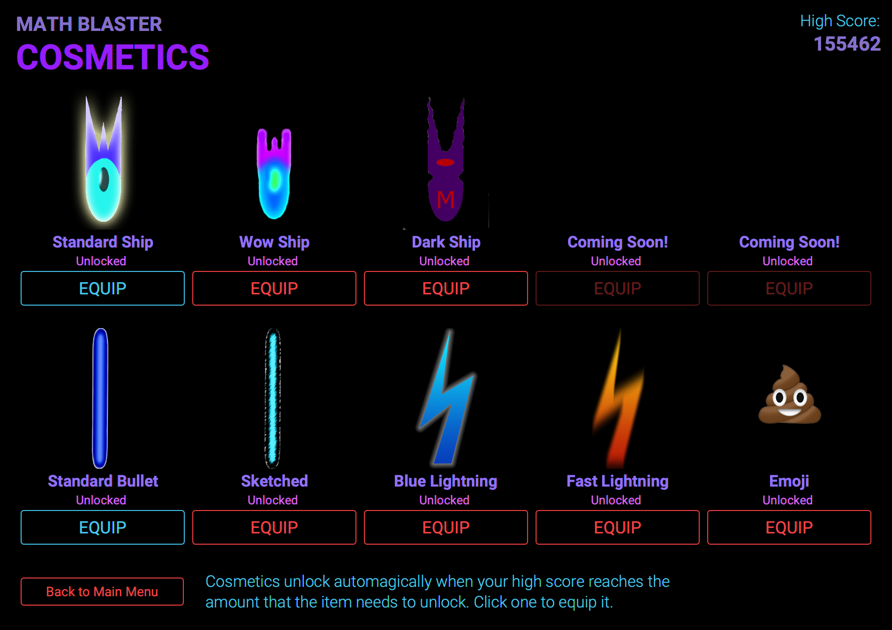
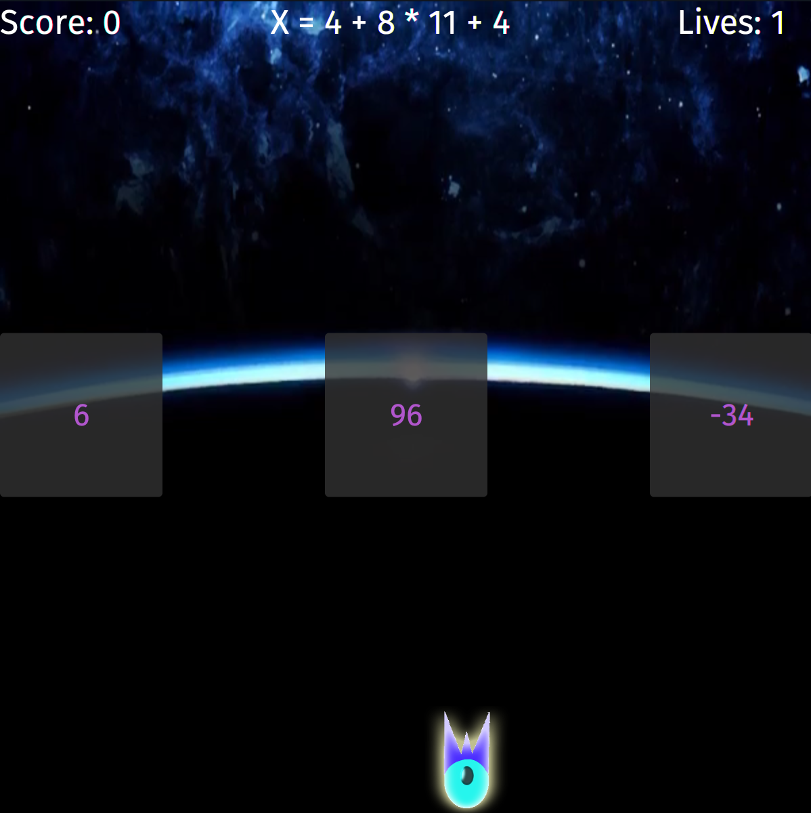
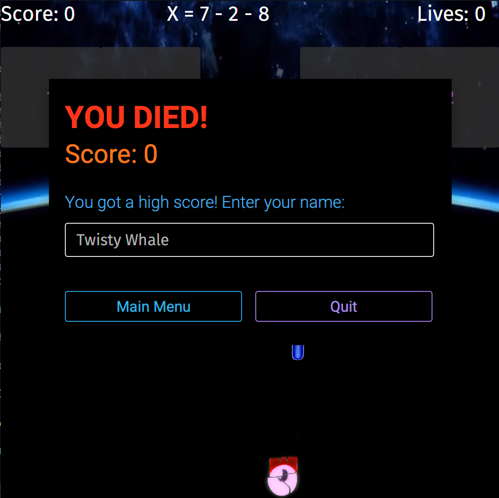

# Rhombiz

My Software Engineering 2 team embarked on a class project to create a mobile business management system for small business owners. The Android app, written in C# on the Xamarin platform, features an inventory manager, employee management system, inventory manager, employee scheduling system, and a client appointment scheduling system. The app connects to an Oracle database using an ASP.NET Core web backend. More screenshots will be posted soon.

# Echelon

An online version of [Star Realms](https://www.starrealms.com). The goal is a fully functioning version of the game where anyone can play around the world in real time, in matches of 4-6 players. The project is an ASP.NET Core web app with a lot of frontend JavaScript to manage the game itself, using SignalR to communicate with the server and other clients in real time. I don't currently have any screenshots of the game interface itself, as it is still very much a work in progress.

# RUSecure CTF Platform

Radford University's RUSecure Capture the Flag (CTF) contest is a cybersecurity contest where users find "flags" hidden in virtual machines, web applications, software binaries, cryptographic messages, and even social media and enter these flags to gain points. Players compete to win. The contest platform is based off of ColdHeat's [CTFd](https://github.com/CTFd/CTFd), with extensive customizations and improvements to suit the unique requirements of Radford's contest.

# Math Blaster

For my Software Engineering 1 class project, me and several team members were tasked with creating a fun, yet educational game that could be played by any age range and help students develop valuable skills. Math Blaster is a scrolling "shooter" game, where players are given an equation at the top of the screen and must use their ship to shoot the correct answer before the answers reach the bottom of the screen, crushing the ship. The game features several difficulties suiting nearly all K-12 grades, and includes a cosmetics shop where players can unlock visual upgrades to their ship and bullets as they achieve higher scores.

